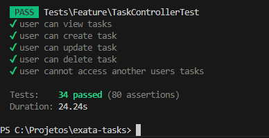

## Checklist de Backlog - Exata-tasks

**Ambiente** 
[✅] Configurar ambiente e repositório  
[✅] Implementar login com Breeze + Vue  

**Tarefas** 
[✅] Criar uma interface para criação de tarefas, com campos de título, descrição e status. 
[✅] Garantir que cada tarefa tenha um status: "pendente", "em andamento" ou "concluída". 
[✅] Utilizar migrações para criação de tabelas no banco de dados (usuários, tarefas). 
[✅] Implementar edição de tarefas para usuários autenticados. 
[✅] Implementar visualização de detalhes das tarefas. 
[✅] Permitir exclusão de tarefas. 
[✅] Deixar responsivo. 

**Filtros** 
[✅] Adicionar filtros para exibir tarefas com base no status. 
[✅] Adicionar ordenação de tarefas por data de criação. 
[✅] Adicionar ordenação de tarefas por data de atualização. 

**Validação** 
[✅] Implementar validação para campos obrigatórios. 
[✅] Validar comprimento e formato de entrada para o campo título. 
[✅] Validar que o campo status tenha um valor permitido ("pendente", "em andamento" ou "concluída"). 
[✅] Validar que o e-mail seja único e tenha formato válido. 

**Permissões** 
[✅] Implementar roles de usuário: "comum" e "admin". 
[✅] Permitir que usuários comuns visualizem apenas suas próprias tarefas. 
[✅] Permitir que o perfil "admin" visualize todas as tarefas criadas no sistema. 
[✅] Criar um middleware para proteger as rotas pelo roles  

**Extras** 
[✅] Adicionar testes unitários básicos para funcionalidades principais. 

[✅] Configurar Docker  
[✅] Toast de notificação reativo, usando FlashMessage do Inertia  
[✅] Script de ativação  
[ ] DarkMode  

